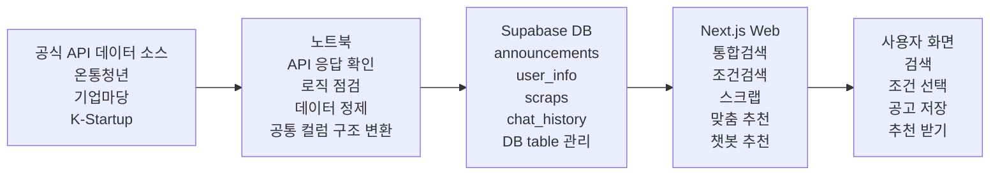
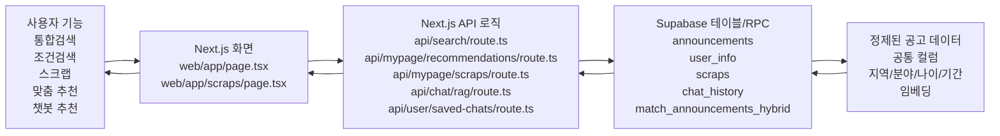

# PolicyRec 발표자료 작업분담안

작성일: 2026-05-14  
기준 문서: `PolicyRec_데모시나리오_통합본_v3.md`  
목표: `나(발표자)`가 지금 확보한 1~2시간 동안 발표의 큰 흐름과 파이프라인 초안을 먼저 잡고, 보미님/창엽님이 자료 보강, 사실 검수, 로직 검수, 이미지 2 초안을 병렬로 맡을 수 있게 정리한다.

---

## 1. 발표 방향 요약

발표 흐름은 아래 순서를 유지한다.

1. 짧은 문제 제기
2. 웹 시연 먼저
3. 방금 본 기능의 전체 구조 설명
4. 데이터 소스 선택 이유
5. 데이터 정제 / DB / Next.js 역할
6. 통합검색·조건검색·추천 로직
7. 구현하면서 어려웠던 점
8. 한계와 개선 방향

데모 흐름은 아래 순서를 기준으로 한다.

1. 통합검색: "부산에서 전세사기 당했는데 피해 지원받을 수 있을까"
2. 추천순 / 마감순 / 신규순 정렬 설명
3. 조건검색: 서울특별시 + 창업 + 나이 25세
4. 공고 스크랩
5. 맞춤 추천 또는 챗봇 추천

발표 톤은 "MVP 기준에서 안정적으로 보여줄 수 있는 기능" 중심으로 유지한다. 불안정하거나 미구현인 기능은 강조하지 않는다.

---

## 2. PPT 목차 추천

| 번호 | 슬라이드 | 역할 |
|---:|---|---|
| 1 | 제목 / 팀 소개 | 발표 시작, 팀과 서비스명 소개 |
| 2 | 문제 제기: 정책 공고가 흩어져 있음 | 왜 만들었는지 짧게 설명 |
| 3 | 서비스 한 줄 소개: PolicyRec | 해결 방향 한 문장으로 제시 |
| 4 | 웹 시연 흐름 안내 | 데모 순서와 오늘 보여줄 기능 예고 |
| 5 | 데모 1: 통합검색 | 문장형 검색 시연 |
| 6 | 데모 2: 조건검색 + 정렬 | 조건 조합과 정렬 차이 시연 |
| 7 | 데모 3: 스크랩 + 추천/챗봇 | 저장 후 추천으로 이어지는 흐름 |
| 8 | 전체 구현 파이프라인 이미지 | API → 정제 → DB → 웹 → 사용자 구조 |
| 9 | 데이터 소스 선택 이유 | 온통청년/기업마당/K-Startup 선택 근거 |
| 10 | 데이터 정제 / DB / Next.js 역할 | 노트북, Supabase, Next.js 역할 분리 |
| 11 | 파일·기능 연관 구조 이미지 | 기능 → 화면/API → DB → 정제 데이터 관계 |
| 12 | 검색·추천 로직 요약 | 통합검색, 조건검색 추천순, 맞춤 추천 설명 |
| 13 | 어려웠던 점 | 데이터 구조, 조건 충돌, 정렬 기준 조정 |
| 14 | 한계와 개선 방향 | MVP 한계와 향후 개선 |
| 15 | 마무리 | 핵심 메시지 재정리 |

---

## 3. 슬라이드별 제작 표
##### * 넘버5-7(데모 1-3)은 실제 시연으로 보여줄거라 굳이 캡쳐할 필요는 없지만 저희 내부 확인용으로 필요하다면 캡쳐해도 좋을 것 같아요.

| 슬라이드 | 주요 내용 | 주 담당 | 보조/검수 | 나(발표자) 역할 | 팀원이 줄 자료 | 우선순위 |
|---:|---|---|---|---|---|---|
| 1 | 제목, 팀명, 서비스명 | 나(발표자) | - | PPT 빈 틀 작성, 톤 결정 | 팀명/서비스명 확인 | P0 |
| 2 | 정책 공고가 여러 기관에 흩어진 문제 | 나(발표자) | 보미님 | 짧은 문제 제기 문장 확정 | 공고가 흩어진 사례 문장 1~2개 | P0 |
| 3 | PolicyRec 한 줄 소개 | 나(발표자) | 보미님/창엽님 | 한 줄 소개를 발표 톤으로 압축 | 과장 없는 서비스 정의 문장 | P0 |
| 4 | 웹 시연 흐름 안내 | 나(발표자) | 창엽님 | 데모 순서 최종 확정 | 데모 위험도 체크 결과 | P0 |
| 5 | 데모 1: 통합검색 | 창엽님 | 보미님 | 최종 시연 흐름 반영 | 안정성 검수, 검색 결과 캡처/주의점 | P0 |
| 6 | 데모 2: 조건검색 + 정렬 | 창엽님 | 보미님 | 최종 시연 흐름 반영 | 조건검색/정렬 안정성 검수, 캡처/설명 문장 | P0 |
| 7 | 데모 3: 스크랩 + 추천/챗봇 | 창엽님 | 보미님 | 맞춤 추천/챗봇 중 최종 선택 | 스크랩/추천/챗봇 위험도 표, 안정 대체안 | P0 |
| 8 | 전체 구현 파이프라인 이미지 | 나(발표자) | 보미님 | 이미지 1의 큰 흐름 1차 초안 제작 | 보미님 검수/보강 문장, DB 테이블 확인 | P0 |
| 9 | 데이터 소스 선택 이유 | 나(발표자) | 보미님 | 3개 API 선택 이유 1차 문장 작성 | 보미님 자료 보강/표현 검수 | P0 |
| 10 | 데이터 정제 / DB / Next.js 역할 | 나(발표자) | 보미님 + 창엽님 | 노트북→Supabase→Next.js 역할 1차 정리 | 보미님 DB/정제 검수, 창엽님 웹 연결 검수 | P0 |
| 11 | 파일·기능 연관 구조 이미지 | 창엽님 | 보미님 | 이미지 톤 통일 후 PPT 삽입 | 이미지 2 초안, 실제 파일명/테이블명 확인 결과 | P0 |
| 12 | 검색·추천 로직 요약 | 창엽님 | 보미님 | 발표자가 말할 수 있게 3문장 압축 | 통합검색/조건검색/추천 로직 검수 문장 | P0 |
| 13 | 어려웠던 점 | 보미님 + 창엽님 | 나(발표자) | 팀원 자료를 발표용 문장으로 압축 | 데이터/DB 어려움 1개, 검색/추천 어려움 1~2개 | P1 |
| 14 | 한계와 개선 방향 | 보미님 + 창엽님 | 나(발표자) | 과장 없는 마무리 문장 확정 | MVP 한계/개선 방향 목록 | P1 |
| 15 | 마무리 | 나(발표자) | - | 최종 메시지 정리 | 핵심 메시지 확인 | P1 |

---

## 4. 이미지 1: 파이프라인 흐름 이미지 초안

### 담당

주 담당: 나(발표자)  
보미님: 데이터 소스, 정제, DB 테이블 설명이 실제 구현과 맞는지 검수/보강  
창엽님: Next.js 기능 연결 표현이 검색/추천 로직과 어긋나지 않는지 보조 검수

### 목적

서비스를 모르는 사람도 "데이터가 어디서 와서 어떻게 웹 기능으로 이어지는지" 한눈에 이해하도록 만든다. 노트북, Supabase, Next.js를 모르는 사람도 역할을 감으로 이해할 수 있어야 한다.

### 핵심 메시지

공식 API 데이터가 노트북에서 정제되고, Supabase DB에 저장된 뒤, Next.js 웹 기능으로 연결되어 사용자가 조건에 맞는 정책을 탐색한다.

### PPT 도식 구성

```text
온통청년 / 기업마당 / K-Startup
        ↓
노트북: API 응답 확인 + 데이터 정제 + 로직 점검
        ↓
Supabase: 정제된 공고 데이터 + 사용자 관련 데이터 관리
        ↓
Next.js Web: 통합검색 / 조건검색 / 스크랩 / 맞춤 추천 / 챗봇 추천
        ↓
사용자: 내 조건에 맞는 정책 탐색
```

### Mermaid 초안



### 나(발표자) 1차 산출물

- PPT에 넣을 이미지 1 초안 1개
- API → 노트북 → Supabase → Next.js → 사용자 흐름 문장 3~5개
- 슬라이드 8~10의 1차 문장
- 보미님에게 검수 요청할 확인 필요 목록

### 보미님 전달 산출물

- 이미지 1 초안에 대한 수정/보강 의견
- API 3개 선택 이유 보강 문장 3~5개
- 노트북 → Supabase → Next.js 구조 설명 검수 결과
- `announcements`, `user_info`, `scraps`, `chat_history` 발표용 설명 1줄씩
- 검수 완료/수정 필요 목록

### 보미님 확인 포인트

- `chat_history`와 `saved_chats` 중 발표용 명칭은 현재 API 기준 `chat_history`가 맞는지 확인
- Supabase에 실제 적재된 CSV 버전이 무엇인지 확인
- 공통 컬럼 설명이 실제 `announcements` 스키마와 어긋나지 않는지 확인
- "정제 자동화 완료"처럼 들리는 표현은 피하고, "정제해서 저장했다" 정도로 유지

---

## 5. 이미지 2: 파일/기능 연관 구조 이미지 초안

### 담당

주 담당: 창엽님  
나(발표자): 최종 PPT 톤에 맞게 크기/색/문장만 정리

### 목적

사용자 기능이 어떤 화면/API 로직과 연결되고, 어떤 DB 테이블과 정제 공고 데이터를 사용하는지 빠르게 이해하도록 만든다. 너무 세부 파일까지 넣지 않고, 발표자가 설명할 핵심 연결만 보여준다.

### 핵심 메시지

사용자 기능은 Next.js 화면과 API route를 거쳐 Supabase 테이블과 정제된 `announcements` 데이터로 연결된다.

### 현재 repo 기준 핵심 파일/영역

| 기능 | Next.js 화면/API 로직 | Supabase 테이블/RPC | 정제 데이터 |
|---|---|---|---|
| 통합검색 | `web/app/page.tsx`, `web/app/api/search/route.ts` | `announcements`, `match_announcements_hybrid`, `match_announcements` fallback | `data/csv/main/main_v1_1_12.csv` 확인 필요: 실제 적재 버전 |
| 조건검색 | `web/app/page.tsx`, `web/app/api/search/route.ts` | `announcements` | `s_category`, `region`, `target_age_min`, `target_age_max` |
| 정렬 | `web/app/page.tsx`, `web/app/api/search/route.ts` | `announcements.apply_end_dt`, `announcements.apply_start_dt`, similarity/condition score | 정제된 신청 기간, 임베딩 |
| 스크랩 | `web/app/page.tsx`, `web/app/scraps/page.tsx`, `web/app/api/mypage/scraps/route.ts`, `web/app/api/announcements/by-ids/route.ts` | `scraps`, `announcements` | 공고 ID 기준 연결 |
| 맞춤 추천 | `web/app/page.tsx`, `web/app/api/mypage/recommendations/route.ts` | `user_info`, `scraps`, `announcements`, `match_announcements_hybrid` | 프로필 조건 + 스크랩 기반 후보 |
| 챗봇 추천 | `web/app/page.tsx`, `web/app/api/chat/rag/route.ts`, `web/app/api/user/saved-chats/route.ts` | `user_info`, `announcements`, `chat_history`, `match_announcements_hybrid` | 공고 내용 + 사용자 질문 |
| DB 연결 | `web/lib/supabase.ts` | Supabase project | 전체 테이블 접근 |
| 임베딩/LLM | `web/lib/gemini.ts` | `announcements.embedding` | 공고 텍스트 임베딩 |

### Mermaid 초안



### 창엽님 전달 산출물

- PPT에 바로 넣을 이미지 2 초안 1개
- 실제 파일명/테이블명 확인 결과 표
- 통합검색/조건검색/추천순/스크랩/맞춤 추천/챗봇 추천 검수 문장
- 데모 위험도 표: 안정 / 주의 / 생략 가능
- 수정 필요 목록 또는 발표에서 피해야 할 표현 목록

### 창엽님 확인 포인트

- `web/app/api/search/route.ts`가 통합검색과 조건검색 모두 담당하는 설명이 맞는지 확인
- `web/app/api/mypage/recommendations/route.ts`의 추천 신호를 발표용으로 단순화해도 되는지 확인
- `web/app/api/chat/rag/route.ts` 설명이 현재 MVP 범위를 넘지 않는지 확인
- 데모에서 챗봇 추천이 불안정하면 맞춤 추천 중심으로 바꾸고 챗봇은 "가능한 흐름" 정도로만 언급

---

## 6. 역할 분담안

### 나(발표자): 발표 흐름 / 파이프라인 초안 / 최종 취합

담당 범위:

- 발표자
- PPT 빈 틀과 전체 흐름 먼저 잡기
- 파이프라인 이미지 1의 큰 흐름 1차 초안 만들기
- 슬라이드 8~10의 1차 설명 문장 만들기
- PPT 최종 취합 및 디자인 톤 통일
- 대본과 데모 시나리오 최종 통합
- 최종 발표 흐름 결정
- 팀원들이 준 자료를 받아 PPT에 반영
- 데모 순서 최종 확정 및 리허설

하지 않아도 되는 일:

- 데이터 소스 자료를 깊게 조사하기
- DB 테이블 설명 직접 검수하기
- 검색/추천 로직을 코드 기준으로 세부 검증하기
- 이미지 2를 처음부터 직접 제작하기
- 데모 위험도 표를 직접 만들기

나(발표자)의 P0:

- PPT 빈 틀 만들기
- 파이프라인 이미지 1의 1차 초안 만들기
- 슬라이드 8~10의 1차 문장 작성
- 팀원 자료 취합
- 발표 대본 최종 압축
- 데모 순서 최종 확정
- 최종 리허설

### 보미님: 데이터 소스 / 데이터 정제 / DB 흐름 담당

담당 범위:

- 나(발표자)가 만든 파이프라인 이미지 1 초안 검수/보강
- 온통청년, 기업마당, K-Startup 선택 이유 자료 정리
- 노트북 → Supabase → Next.js 구조 설명 검수 및 보강
- `announcements`, `user_info`, `scraps`, `chat_history` 등 발표용 DB 테이블 설명 검수
- 데이터 정제 설명이 실제 구현과 맞는지 확인
- PPT에 바로 넣을 수 있는 문장/도식/캡처 자료 제공

보미님 P0:

- 이미지 1 초안 검수 및 보강
- API 3개 선택 이유 문장 완성
- 노트북 → Supabase → Next.js 설명 검수
- 발표용 DB 테이블 설명 검수
- 데이터 정제 설명에서 과장 표현 제거

### 창엽님: 기능/파일 구조 / 검색·추천 로직 담당

담당 범위:

- 파일/기능 연관 구조 이미지 2 제작
- 통합검색, 조건검색, 추천순, 스크랩, 맞춤 추천, 챗봇 추천 로직 검수
- 실제 repo 기준 핵심 파일명과 DB 테이블 연결 확인
- 데모에서 안정적인 기능/주의할 기능/생략할 기능 구분
- PPT에 바로 넣을 수 있는 문장/도식/캡처 자료 제공

창엽님 P0:

- 이미지 2 초안 완성
- 통합검색/조건검색/추천 로직 검수
- 데모 위험도 표 작성
- 실제 파일명/테이블명 확인 결과 작성
- 발표에서 피해야 할 로직 과장 표현 표시

---

## 7. 팀원별 체크리스트

### 나(발표자) 체크리스트

- [ ] PPT 15장 빈 틀 생성
- [ ] 발표 흐름을 문제 제기 → 데모 → 구조 설명 순서로 배치
- [ ] 이미지 1 파이프라인 1차 초안 제작
- [ ] 슬라이드 8~10의 1차 설명 문장 작성
- [ ] 보미님에게 이미지 1/데이터/DB 설명 검수 요청
- [ ] 보미님 자료 받을 자리 표시
- [ ] 창엽님 자료 받을 자리 표시
- [ ] 팀원 자료 취합 후 슬라이드 톤 통일
- [ ] 대본을 슬라이드별 1~2문장으로 압축
- [ ] 데모 순서 최종 확정
- [ ] 불안정 기능은 발표에서 빼거나 짧게 언급
- [ ] 최종 리허설

### 보미님 체크리스트

- [ ] 나(발표자)가 만든 이미지 1 파이프라인 초안 검수
- [ ] 이미지 1에서 빠진 데이터/DB 흐름 보강
- [ ] 온통청년 역할 1문장 작성
- [ ] 기업마당 역할 1문장 작성
- [ ] K-Startup 역할 1문장 작성
- [ ] 세 API를 함께 쓰는 이유 1~2문장 작성
- [ ] 노트북 역할 설명 작성: API 응답 확인, 로직 점검, 데이터 정제
- [ ] Supabase 역할 설명 작성: 정제 공고 데이터와 사용자 관련 데이터 관리
- [ ] Next.js 역할 설명 작성: 검색/조건검색/스크랩/추천/챗봇 기능 연결
- [ ] `announcements`, `user_info`, `scraps`, `chat_history` 발표용 설명 검수
- [ ] 실제 Supabase 적재 CSV 버전 확인 또는 확인 필요 표시
- [ ] 데이터 정제 설명 중 과장 표현 표시
- [ ] PPT에 바로 붙일 문장 3~5개 전달

### 창엽님 체크리스트

- [ ] 이미지 2 파일/기능 연관 구조 초안 제작
- [ ] 통합검색 관련 파일/API/DB 연결 확인
- [ ] 조건검색 관련 파일/API/DB 연결 확인
- [ ] 추천순 정렬 설명이 현재 구현과 맞는지 검수
- [ ] 스크랩 관련 파일/API/DB 연결 확인
- [ ] 맞춤 추천 관련 파일/API/DB 연결 확인
- [ ] 챗봇 추천 관련 파일/API/DB 연결 확인
- [ ] 실제 핵심 파일명과 테이블명 표로 정리
- [ ] 데모 기능별 위험도 표 작성
- [ ] 챗봇 추천이 불안정하면 맞춤 추천 중심 대체안 작성
- [ ] 발표용 로직 설명을 3~5문장으로 압축
- [ ] PPT에 바로 붙일 문장 3~5개 전달

---

## 8. 각자 전달해야 하는 산출물

| 담당 | 내일까지 전달할 산출물 | 형식 |
|---|---|---|
| 나(발표자) | PPT 빈 틀, 발표 흐름, 파이프라인 이미지 1 초안, 자료 받을 자리 | PPT 초안 |
| 보미님 | 파이프라인 이미지 1 검수/보강 의견 | 수정 제안, 문장, 또는 보강 도식 |
| 보미님 | 데이터 소스 선택 이유 | PPT에 넣을 문장 3~5개 |
| 보미님 | 노트북 → Supabase → Next.js 설명 | 짧은 문단 또는 표 |
| 보미님 | DB 테이블 설명 검수 결과 | 검수 완료/수정 필요 목록 |
| 보미님 | 데이터 정제 과장 표현 점검 | 피해야 할 표현/수정 문장 |
| 창엽님 | 파일/기능 연관 이미지 2 초안 | 이미지, Mermaid, 또는 PPT 도형 |
| 창엽님 | 실제 파일명/테이블명 확인 결과 | 표 |
| 창엽님 | 검색·추천 로직 검수 결과 | 검수 완료/수정 필요 목록 |
| 창엽님 | 데모 위험도 표 | 안정 / 주의 / 생략 가능 |
| 창엽님 | 발표용 로직 설명 | PPT에 넣을 문장 3~5개 |

---

## 9. 우선순위

### P0: 오늘/내일 먼저 끝낼 자료

나(발표자) P0:

- PPT 빈 틀 만들기
- 파이프라인 이미지 1의 1차 도식 만들기
- 슬라이드 8~10의 1차 문장 작성
- 팀원 자료 받을 위치 잡기
- 팀원 자료 취합
- 발표 대본 최종 압축
- 데모 순서 최종 확정
- 최종 리허설

보미님 P0:

- 이미지 1 파이프라인 도식 검수/보강
- API 3개 선택 이유 문장 3~5개
- 노트북 → Supabase → Next.js 설명 검수/보강
- 발표용 DB 테이블 설명 검수
- 데이터 정제 설명 과장 여부 체크

창엽님 P0:

- 이미지 2 파일/기능 연관 도식 완성
- 통합검색/조건검색/추천순 로직 검수
- 스크랩/맞춤 추천/챗봇 추천 안정성 검수
- 데모 위험도 표 작성
- 실제 파일명/테이블명 확인 결과 작성
- 슬라이드 5~7, 11~12에 넣을 핵심 문장 초안

### P1: 시간이 있으면 완성도 높이기

- 데모 화면 캡처를 실제 PPT에 삽입
- 정렬 전후 캡처 추가
- 어려웠던 점을 QA 로그 기반으로 더 구체화
- 한계와 개선 방향을 발표용 문장으로 다듬기
- 슬라이드 디자인 톤 통일
- 발표 리허설 후 말이 긴 슬라이드 줄이기

### P2: 시간이 부족하면 생략 가능

- 관리자 페이지 설명
- 알림 설정 설명
- 세부 DB 스키마 컬럼 설명
- 모든 API route 상세 설명
- 챗봇 대화 저장/복원 상세 설명
- 고급 RAG 구조 설명
- 추천 점수 가중치 상세 수치 설명

---

## 10. 데모 기능 구분

### 반드시 보여줄 기능

| 기능 | 이유 | 데모 문장 | 검수 담당 |
|---|---|---|---|
| 통합검색 | 서비스 핵심 진입점 | "부산에서 전세사기 당했는데 피해 지원받을 수 있을까" | 창엽님 |
| 추천순 정렬 | 단순 목록이 아니라 관련도를 고려한다는 점 전달 | "검색어 유사도를 기준으로 관련도가 높은 공고를 먼저 보여드려요." | 창엽님 |
| 마감순 / 신규순 | 사용자가 목적에 따라 결과를 다르게 볼 수 있음 | "마감이 급한 공고와 새로 올라온 공고도 볼 수 있습니다." | 창엽님 |
| 조건검색 | 지역/분야/나이 조건으로 공고를 좁히는 핵심 기능 | 서울특별시 + 창업 + 나이 25세 | 창엽님 |
| 공고 스크랩 | 검색 결과를 개인 행동으로 연결 | "관심 공고를 나중에 다시 볼 수 있습니다." | 창엽님 |

### 둘 중 하나만 보여줘도 되는 기능

| 기능 | 권장도 | 판단 기준 | 검수 담당 |
|---|---|---|---|
| 맞춤 추천 | 높음 | 스크랩/프로필 기반 결과가 안정적으로 보이면 우선 사용 | 창엽님 |
| 챗봇 추천 | 중간 | 당일 응답 품질이 안정적일 때만 짧게 시연 | 창엽님 |

### 시간이 없으면 생략 가능한 기능

| 기능 | 생략 이유 |
|---|---|
| 챗봇 후속질문 refinement | 설명이 길고 안정성 확인이 필요 |
| 저장 대화 복원 | 핵심 발표 흐름에서 벗어남 |
| 관리자 페이지 | 서비스 핵심 사용자 흐름이 아님 |
| 알림 설정 | MVP 발표 핵심 기능이 아님 |
| 세부 추천 가중치 | 초보 개발자/팀 발표에서 과하게 기술적으로 보일 수 있음 |

---

## 11. 과장 표현 점검

발표에서 피해야 할 표현:

- "모든 정책을 완벽하게 수집했습니다."
- "사용자에게 가장 적합한 정책을 정확히 추천합니다."
- "챗봇이 모든 공고 내용을 완벽히 이해합니다."
- "데이터 수집과 정제가 완전 자동화되었습니다."
- "실제 운영 서비스 수준의 추천 시스템입니다."

발표에서 써도 되는 표현:

- "MVP 기준으로 주요 공고 데이터를 통합해 검색할 수 있도록 구성했습니다."
- "공식 API 3개를 사용해 청년, 창업, 기업 지원사업 범위를 넓혔습니다."
- "공통 컬럼 구조로 정제해 검색과 조건 필터에 활용했습니다."
- "추천순은 검색어 유사도와 조건 적합도를 바탕으로 관련도가 높은 공고를 먼저 보여주는 흐름입니다."
- "현재 추천은 단순 규칙 기반에 가까우며, 향후 더 정교화할 수 있습니다."
- "챗봇은 현재 MVP 기준에서 관련 공고를 찾아주는 흐름으로 구현했습니다."

주의해서 말할 부분:

- 챗봇은 복잡한 대화 능력보다 "관련 공고 추천 흐름" 중심으로 설명
- 맞춤 추천은 "개인화 추천의 시작점" 정도로 설명
- 데이터 정제는 "완벽"이 아니라 "서비스에서 사용할 공통 구조로 정리"라고 설명
- DB 테이블은 발표용 핵심 테이블만 언급하고 세부 컬럼은 생략

---

## 12. 슬라이드별 대본 포인트

| 슬라이드 | 대본 포인트 | 초안 제공 |
|---:|---|---|
| 1 | "안녕하세요. 정책 공고 탐색 서비스 PolicyRec을 소개하겠습니다." | 나(발표자) |
| 2 | "정책 공고는 여러 기관에 흩어져 있고, 사용자는 조건을 직접 확인해야 합니다." | 나(발표자) |
| 3 | "PolicyRec은 흩어진 정책 공고를 한곳에 모아 내 조건에 맞는 공고를 쉽게 찾도록 만든 서비스입니다." | 나(발표자) |
| 4 | "먼저 실제 웹 화면에서 통합검색, 조건검색, 스크랩, 추천 흐름을 보여드리겠습니다." | 나(발표자) |
| 5 | "정확한 공고명을 몰라도 내 상황을 문장으로 입력해 관련 공고를 찾을 수 있습니다." | 창엽님 검수 |
| 6 | "검색 결과는 추천순, 마감순, 신규순으로 볼 수 있고, 조건검색에서는 지역·분야·나이로 결과를 좁힙니다." | 창엽님 검수 |
| 7 | "관심 공고를 스크랩하고, 저장한 정보나 스크랩 이력을 바탕으로 추천 흐름까지 이어집니다." | 창엽님 검수 |
| 8 | "방금 본 기능은 공식 API 데이터가 정제되고 DB를 거쳐 웹 기능으로 연결된 결과입니다." | 나(발표자) 초안 + 보미님 검수 |
| 9 | "온통청년은 청년 정책, 기업마당은 기업 지원사업, K-Startup은 창업 지원사업을 보기 위해 선택했습니다." | 나(발표자) 초안 + 보미님 보강 |
| 10 | "노트북은 데이터 확인과 정제, Supabase는 DB 관리, Next.js는 실제 웹 기능 연결을 담당합니다." | 나(발표자) 초안 + 보미님 검수 |
| 11 | "사용자 기능은 Next.js 화면/API를 거쳐 Supabase 테이블과 정제된 공고 데이터로 연결됩니다." | 창엽님 초안 |
| 12 | "통합검색은 검색어 유사도를 보고, 조건검색 추천순은 조건과 더 맞는 공고가 위에 오도록 점수화했습니다." | 창엽님 초안 |
| 13 | "가장 어려웠던 점은 API마다 다른 데이터를 공통 구조로 맞추고, 검색 조건이 섞여도 결과가 흔들리지 않게 조정하는 일이었습니다." | 보미님/창엽님 |
| 14 | "현재는 MVP 단계라 데이터 정제와 추천 품질은 더 개선할 수 있고, 향후 자동화와 RAG 고도화가 가능합니다." | 보미님/창엽님 |
| 15 | "PolicyRec은 정책 탐색을 한곳에서 시작할 수 있게 만든 MVP이며, 앞으로 추천 품질과 데이터 흐름을 더 고도화할 수 있습니다." | 나(발표자) |

---

## 13. 최종 제작 순서 제안

1. 나(발표자)가 PPT 빈 틀, 발표 흐름, 파이프라인 이미지 1의 1차 초안을 먼저 잡는다.
2. 보미님은 파이프라인/데이터/DB 설명을 검수하고, 창엽님은 기능/파일 구조와 데모 안정성을 검수한다.
3. 창엽님은 이미지 2 초안과 데모 위험도 표를 작성한다.
4. 나(발표자)가 받은 자료를 PPT에 취합한다.
5. 팀원들이 PPT 내용 중 사실관계만 빠르게 재검수한다.
6. 나(발표자)가 대본을 압축한 뒤 리허설한다.

---

## 14. 마지막 요약

### 나(발표자)가 꼭 해야 하는 일

- PPT 빈 틀 만들기
- 파이프라인 이미지 1의 1차 초안 만들기
- 슬라이드 8~10의 1차 문장 작성
- 팀원 자료 취합
- 슬라이드 디자인 톤 통일
- 발표 대본 최종 압축
- 데모 순서 최종 확정
- 최종 리허설

### 보미님이 내일까지 전달해야 하는 자료

- 파이프라인 흐름 이미지 1 초안 검수/보강 의견
- 온통청년/기업마당/K-Startup 선택 이유 문장 3~5개
- 노트북 → Supabase → Next.js 설명 초안
- `announcements`, `user_info`, `scraps`, `chat_history` 설명 검수 결과
- 데이터 정제 설명의 과장 여부 체크 목록
- PPT에 바로 넣을 수 있는 문장/도식/캡처 자료

### 창엽님이 내일까지 전달해야 하는 자료

- 파일/기능 연관 구조 이미지 2 초안
- 실제 repo 기준 핵심 파일명과 DB 테이블 연결 확인 결과
- 통합검색/조건검색/추천순/스크랩/맞춤 추천/챗봇 추천 로직 검수 결과
- 데모 위험도 표: 안정 / 주의 / 생략 가능
- 발표에서 피해야 할 로직 과장 표현 목록
- PPT에 바로 넣을 수 있는 문장/도식/캡처 자료

### 팀원들에게 부탁할 때 보낼 수 있는 짧은 메시지

보미님, 제가 오늘 파이프라인 이미지 1의 큰 흐름은 먼저 잡아둘게요. 내일 데이터/DB 흐름 쪽에서 이 초안이 실제 구현과 맞는지 검수하고, API 3개 선택 이유, 노트북→Supabase→Next.js 설명, DB 테이블 설명 보강 문장을 PPT에 바로 넣을 수 있게 부탁드립니다.

창엽님, 내일 발표자료에서 기능/파일 구조와 검색·추천 로직 쪽을 맡아주시면 좋겠습니다. 파일/기능 연관 이미지 2 초안, 실제 파일명/테이블명 확인, 통합검색·조건검색·추천순·스크랩·맞춤추천·챗봇추천 로직 검수, 데모 위험도 표를 부탁드립니다. 저는 최종 발표 흐름과 대본 압축을 맡고, 창엽님 자료를 PPT에 반영하겠습니다.
