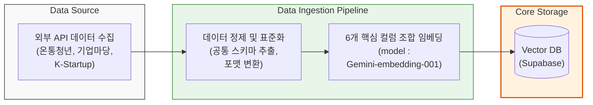
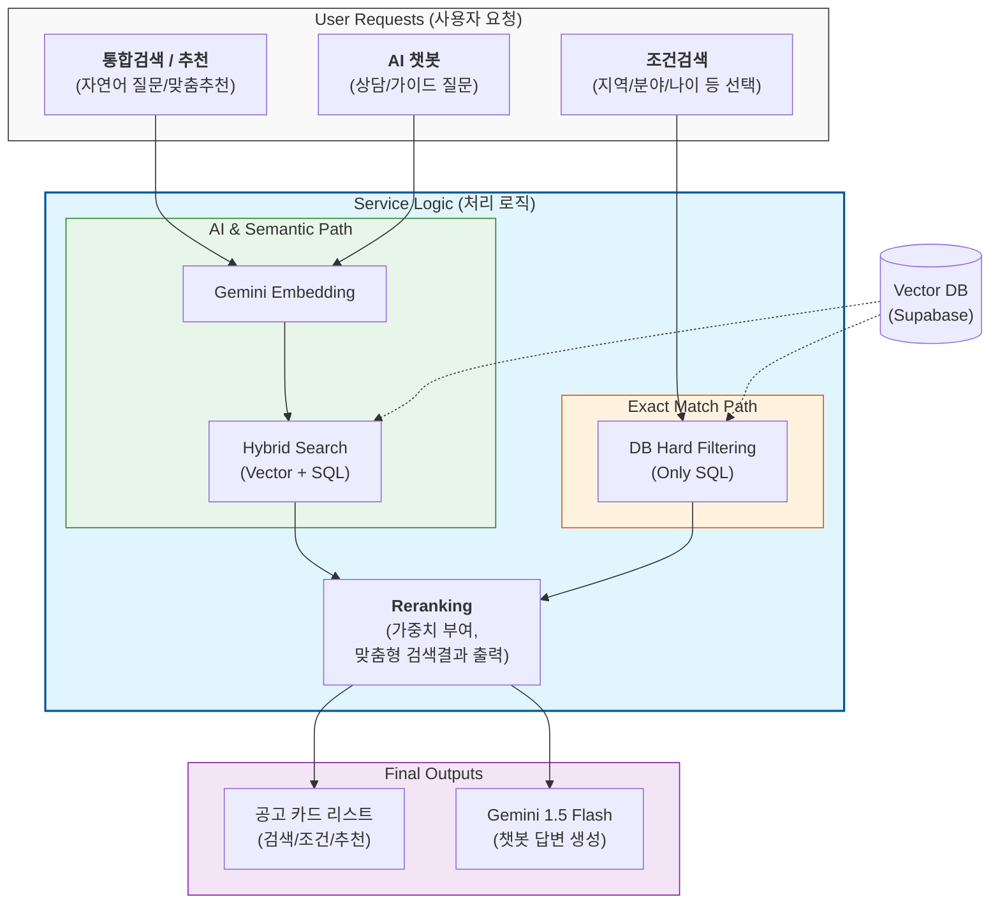

## [확인 포인트]
- 현재 chat_history 테이블 사용중입니다.
- Supabase에 실제 적재된 CSV 버전 : main_v1_1_12.csv
- 이미지 1 초안 주시면 스키마 검토하겠습니다. 
- 현재 Mermaid 초안에 사용중인 테이블목록에 users 테이블 추가 필요 (일부러 빼신건가욤? 뒷단계 로직에 중요한 테이블이 아니긴합니다..!ㅎㅎ)

---

## [슬라이드번호별 자료정리]

### 슬라이드 번호 2. 공고가 흩어진 사례 문장 1~2개
- 이미지 : [정책검색_1][정책검색_2]  (희민님 제가 이해한게 맞나요..? )

### 슬라이드 번호 3. PolicyRec 한 줄 소개
- (1번) 여기저기 흩어져있는 정책들을 한 곳에서 찾아볼 수 있는 웹 서비스
- (2번_AI 소개) 흩어진 수천 건의 정책 중 나에게 꼭 필요한 혜택만 AI가 골라주는, 초개인화 지능형 정책 큐레이션 서비스

### 슬라이드 번호 5-7. 데모
- 데모 관련 테스트케이스 공유해주시면 검토하겠습니다

### 슬라이드 번호 8. 이미지 1 검토
- 이미지1 검토후 기입예정

### 슬라이드 번호 9. 데이터 소스 선택 이유 (3개 API 선택 이유 1차 문장 작성)
- 정부(중앙부처 및 공공기관)가 직접 운영하는 공공 플랫폼이기 때문에 신뢰성 있는 데이터 수집이 가능하고, 각 플랫폼이 특정 정책 분야에 특화되어 있어 폭넓은 정책 정보 제공 가능.

(저는 표면적 이유만 작성했는데 희민님이 처음 이 프로젝트 아이디어 내신 기획의도와 맞닿게 수정하셔도 좋을 것 같습니다)

- 아래는 정리에 사용한 데이터입니다.
1. 온통청년 (청년정책포털)
기관 정보: 국무조정실과 한국고용정보원이 운영하는 대한민국 대표 청년 정책 통합 플랫폼. 2026년 현재 전국 약 3,000여 개의 중앙·지자체 청년 정책 정보를 실시간으로 제공함.
선택 이유: 청년들의 가장 큰 고민인 주거, 금융(자산형성), 교육 분야의 생활 밀착형 정책 데이터를 확보 가능.
2. 기업마당 (BizInfo)
기관 정보: 중소벤처기업부가 운영하는 중소기업·소상공인·스타트업을 위한 정부 지원 사업 통합 안내 플랫폼.
선택 이유: 정책의 범위가 창업 이후의 판로 개출, 수출, 경영 지원까지 아우르기 때문에, '생애 주기' 관점에서 방대한 기업 지원 데이터 확보 가능.
3. K-Startup (KST)
기관 정보: 창업진흥원이 운영(중소벤처기업부가 주관)하는 창업지원 포털. 예비 창업자부터 7년 이내 창업 기업을 위한 전용 사업(Tips, 예비창업패키지 등) 정보가 가장 집약된 곳.
선택 이유: '창업'이라는 특정 분야의 전문성이 높은 사이트로, 기술 사업화 및 공간 지원과 같은 고품질 데이터 확보 가능.

### 슬라이드 번호 13. 어려웠던 점
- 창엽님이 전반부에 작업하신 데이터 정제 파트가 고려할 부분들이 많아서 수정도 여러번 거쳤고, 양질의 데이터를 수집하는 데 중요한 부분이었던 것 같습니다. 룰표 만들면서 정제작업하신 내용도 들어가면 좋을 것 같아요.
(data/csv/rule 안에 있는 룰표들 캡쳐해서 한페이지에 여러장 담아서 보여주기, 아니면 말로 설명해주셔도 좋구요!)

### 슬라이드 번호 14. 한계와 개선 방향 (읽어보시고 필요하다고 생각된다면 써주세요!) 
- 매주 1회 배치 돌려 데이터를 추가 수집하는 로직을 구현했으나 (3개 사이트 api를 호출하여 데이터 추가 수집 후, 통합하여 전처리된 csv파일 생성까지 완료), 시간상 그 뒤에 db 적재까지 진행하지 못함. 이부분까지 자동화 한다면 사용자에게 최신 정책 정보를 제공 가능.

---
## [각 테이블별 설명]
- announcements : 여러 출처(youth, kst, biz)에서 수집된 공고를 통합 관리. 해당 서비스의 중심 데이터
- users : 로그인 정보 테이블.(id, pw 등의 회원가입/로그인시 사용)
- user_info : 회원가입한 사용자 정보. 연령대, 관심분야, 지역 등의 정보를 저장.(맞춤 공고 추천에 사용)
- scraps : 사용자 관심 공고 저장. (맞춤 공고 추천에 사용)
- chat_history : 사용자의 챗봇 대화 이력 저장. 

-----

## [추가적으로 시각화하면 좋을만한 자료]
- 간단한 db 도식화 : 혹시 몰라 ERD_simple.png 만들긴 했는데 erd까지 안 담고 테이블명만 있어도 충분할 것 같아요! 나머지 erd도 최신화해뒀습니다.
- [전체 흐름도]api 수집 -> db적재 -> rag -> 화면구현 순서도 : 한장으로 시도했는데 잘 안되어서 두개 영역으로 분리했습니다.
   >1. Ingestion Layer (데이터 수집 및 적재 로직) 
   >2. Inference & Search Layer (서비스 로직)

   >- 로직이 통합검색/조건검색/챗봇/맞춤정보 다 조금씩 달라서 지금처럼 만들었어요 mermaid 기반으로 이미지 파일 생성했는데 디자인 한계가 있네요. 다시 만드실 때 아래 mermaid 소스 가져다 만들면 오타없이 생성해주더라구요..!
   >- 파이프라인_1번로직_데이터 수집 및 적재.png, 파이프라인_2번로직_서비스로직.png 참고해주세요

----

