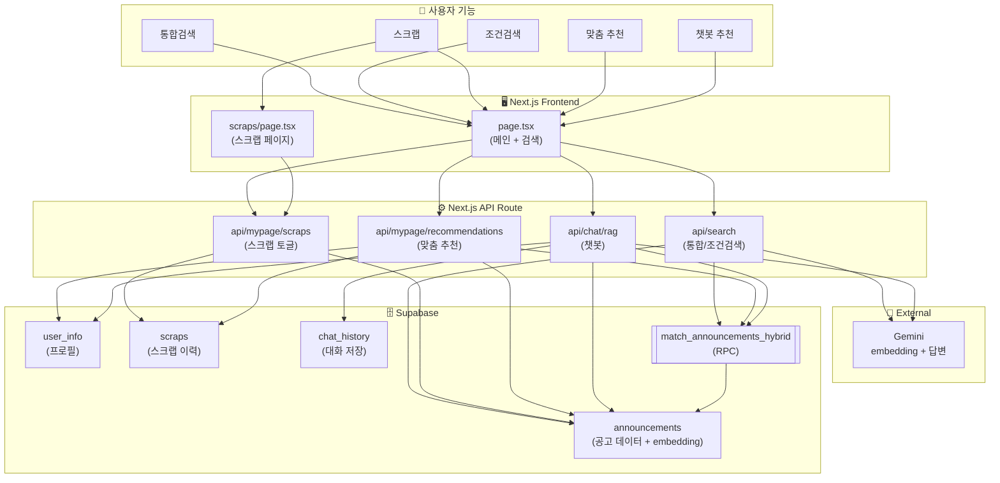
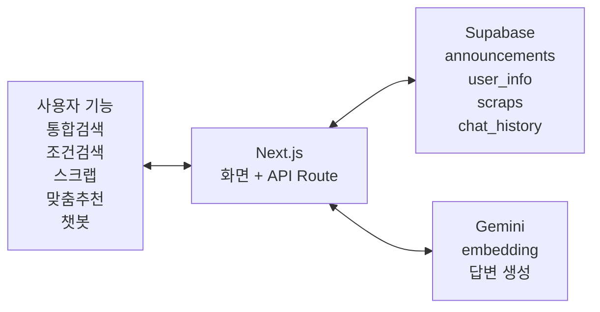

# 이미지 2: PolicyRec 파일/기능 연관 구조

## 목적

사용자 기능이 어떤 Next.js 화면/API와 연결되고, 어떤 Supabase 테이블/RPC를 사용하는지 한눈에 보여줌. 발표자가 설명할 핵심 연결만 표시.

---

## Mermaid 다이어그램

---

## 핵심 메시지

**사용자 기능은 Next.js 화면과 API Route를 거쳐 Supabase 테이블과 RPC로 연결되고, 응답 결과는 다시 화면으로 돌아옵니다.**

- 통합검색: 검색어 → Gemini embedding → pgvector RPC → 공고 검색 → 카드 렌더링
- 조건검색: 사용자 조건 → API → DB hard filter → 적합도 정렬 → 카드 렌더링
- 스크랩: 사용자 토글 → API → `scraps` 테이블 저장/삭제
- 맞춤 추천: `user_info` + `scraps` → RPC + 유사도 → 추천 결과 → 메인/스크랩 페이지
- 챗봇: 질문 + `user_info` + 대화 맥락 → RPC + Gemini 답변 → `chat_history` 저장 → 답변 표시

> ℹ️ 위 다이어그램은 데이터 요청 흐름을 보여줍니다. 결과 응답은 반대 방향으로 흘러 사용자 화면에 표시됩니다.

---

## 단순화 버전 (PPT 슬라이드용)

복잡한 위 도식이 부담스러우면 아래 단순화 버전 사용:

